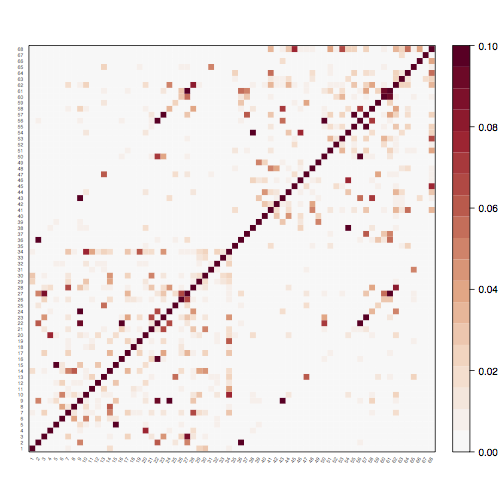
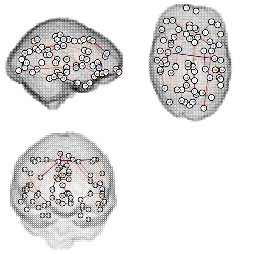

# Connectivity graphs

This page discusses TractoR's facilities for creating, manipulating and visualising abstract graphs representing brain connectivity. Some [parcellated structural data](structural.html) is a prerequisite.

## Creating a graph (diffusion)

Using [diffusion-weighted data](diffusion-processing.html) and tractography, a graph can be created which represents streamline-based connectivity between regions of interest. The general principle is to seed within regions of interest, or across the whole brain; identify sets of streamlines which connect pairs of anatomical regions; and then (optionally) to use properties of these streamlines to derive a quantitative measure of region-to-region connectivity. In TractoR, these three tasks would usually be performed by the `xtrack` (or `mtrack`), `graph-build` and `graph-reweight` scripts.

To generate a set of streamlines, each of which passes through at least one target region of interest, we can use the `xtrack` script. For example,

    tractor xtrack /data/subject1 AnisotropyThreshold:0.2 JitterSeeds:true TractName:all

In this case we seed from every voxel within the brain mask that has an anisotropy of at least 0.2, jittering seed locations randomly to move them off the regular voxel grid. By default the target regions are all areas identified as cerebral cortex in the [parcellation lookup table](structural.html). Other targets, such as subcortical grey matter, can also be included using a command like

    tractor xtrack /data/subject1 AnisotropyThreshold:0.2 JitterSeeds:true TractName:all TargetRegions:cerebral_cortex,deep_grey_matter

A set of streamlines is generated by this script and written into the file "all_streamlines.Rdata". These can then be used to create a graph using a command like

    tractor graph-build /data/subject1 TractName:all TargetRegions:cerebral_cortex,deep_grey_matter GraphName:diffusion_graph

The `TargetRegions` and `TractName` options should match what were used for `xtrack`, and you may want to create a [design file](HNT-tutorial.html#using-a-design-file) for convenience.

At this point you have a binary graph in which an edge exists between each pair of regions connected by at least one streamline. Each edge has attributes like the average voxelwise FA along the streamlines or the number of streamlines constituting the connection, and vertices have attributes such as their volume. These can be used to assign weights to the edges if required. For example,

    tractor graph-reweight nStreamlines GraphName:diffusion_graph

will use the number of streamlines as the weight of the connection. Vertex attributes can also be used, but since there are two such values for each connection, you need to decide how to merge them. For example,

    tractor graph-reweight "nStreamlines/voxelCount" VertexAttributes:mean GraphName:diffusion_graph

will average the two vertex attributes for each edge, and then use the number of streamlines divided by the average voxel count in the two target regions as the weight.

## Creating a graph (BOLD fMRI)

Resting-state fMRI data may be used to establish functional connectivity, or the degree of temporal coincidence between spatially separated cortical areas. Although TractoR does not currently provide scripts for preprocessing functional data ([SPM](http://www.fil.ion.ucl.ac.uk/spm/) and [FSL-FEAT](http://fsl.fmrib.ox.ac.uk/fsl/fslwiki/FEAT) are two well-known software tools that could be used for this purpose), but it does allow already preprocessed data to be imported and used to create functional connectivity graphs.

To get the data into a session directory, the `import` script can be used:

    tractor import /data/subject1 fmri.nii.gz ImageWeighting:functional

Creating a functional connectivity graph then requires three stages, namely

1. propagating a cortical parcellation from structural to functional space;
2. identifying a representative signal trace for each parcellated region of interest; and
3. calculating covariance measures between each pair of regional traces.

The `graph-build` script can be used to perform these tasks. Stage 1, the transformation, is performed implicitly. Stage 2 is controlled by the `RegionTimeSeries` option, which may be "mean" for the mean of the voxelwise time series, or "pc" for the first principal component, which will capture more of the variance within the region but is less standard. At the third stage, several measures of association are calculated, but if the number of time points is modest it can be useful to employ a "shrinkage" approach that TractoR offers (via the [`corpcor` R package](http://strimmerlab.org/software/corpcor/)), which regularises the estimates. For example,

    tractor graph-build /data/subject1 Type:functional UseShrinkage:true GraphName:functional_graph

The resulting binary graph than then be weighted by correlation, say, by using the command

    tractor graph-reweight correlation GraphName:functional_graph

## Graph properties

The basic properties of a graph object can be obtained using the generic `peek` script, viz.

    tractor peek graph.Rdata

However additional graph-theoretical metrics can be calculated and displayed using the `graph-props` script:

    tractor graph-props graph.Rdata

Please note that the latter script requires the optional `igraph` package to be installed.

## Graph visualisation

The `graph-viz` script can be used to visualise graphs, either as an association matrix or in traditional topological form.

    tractor graph-viz GraphName:graph MatrixView:true WeightLimits:0,0.1

    tractor graph-viz GraphName:graph MatrixView:false UseLocations:true ShowBrain:true WeightLimits:0,0.1

## Graph decomposition

For many applications you may be interested subnetworks within the overall brain graph, rather than the entire graph as a whole. You could determine these subnetworks by hand, but TractoR also provides some data-driven approaches to factoring or partitioning a graph into parts. The techniques currently offered are [principal network analysis](http://dx.doi.org/10.1371/journal.pone.0060997) and a [modularity maximisation](http://dx.doi.org/10.1073/pnas.0601602103) partitioning algorithm. Both of these are accessible through the `graph-decompose` script. For example,

    tractor graph-decompose GraphName:graph Method:principal-networks EdgeWeightThreshold:0.2

The principal networks approach uses a matrix factoring approach akin to principal component analysis, while modularity maximisation tries to separate the graph. These and other approaches to graph decomposition, their strengths and weaknesses, are discussed in the [principal networks paper](http://dx.doi.org/10.1371/journal.pone.0060997). Either way, the result is a file called "graph_decomposed.Rdata", which contains a series of smaller graphs. This file can be split into its parts using the `split` script, viz.

    tractor split graph_decomposed.Rdata

The individual graphs can then be visualised, or their graph properties calculated, as needed.
