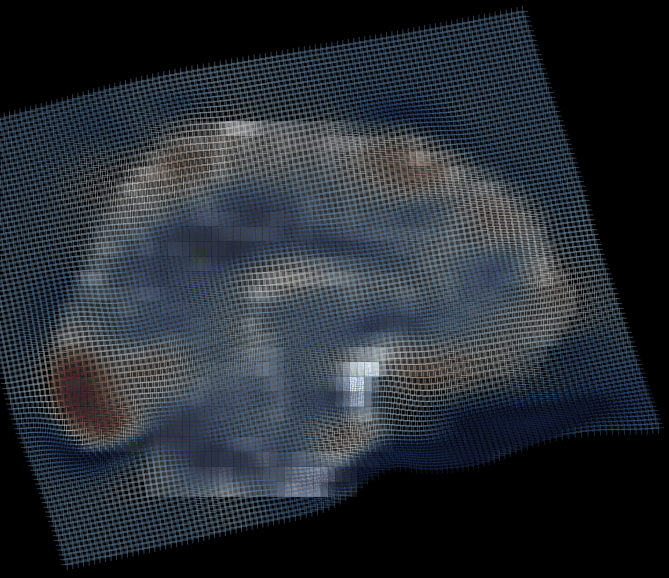

# Registration

This page documents TractoR's facilities for image registration, and the concepts used by them.

## Transformations

Registration is the dual operation of estimating a transformation which will bring a source image into register with a target image, and resampling the source image into target space. The estimation phase is performed by optimising the parameters of the transformation with respect to a cost function which describes how much "difference" or "disagreement" there is between the resampled source image and the target.

The transformation may either be linear, typically represented using an affine matrix, which transforms all parts of the image in the same way; or nonlinear, in which case different parts of the image may be distorted differently. This is illustrated below.

Here, a global rotation can be observed from the oblique grid, but additionally, some areas are expanded by the transformation (red) while others are contracted (blue).

In TractoR, images are stored in Analyze/NIfTI/MGH files, while transformations are stored in binary files with an ".Rdata" suffix. Information about the latter can be obtained using the `peek` script. Transformation objects contain metadata about the source and target files, as well as the actual linear and/or nonlinear transformation information. TractoR's image registration scripts create, modify and use these transformation files as a matter of course.

## Linear registration

Linear registration is performed using the `reg-linear` script. The work of the registration is performed using [NiftyReg](http://www0.cs.ucl.ac.uk/staff/M.Modat/Marcs_Page/Software.html) or [FSL-FLIRT](http://fsl.fmrib.ox.ac.uk/fsl/fslwiki/FLIRT), although the latter requires FSL to be installed separately. (NiftyReg support is built into TractoR.) A source and target image are required as arguments, with the name of the final image to be created as a third argument. There are a number of additional options to control the process: see `tractor -o reg-linear` for details.

For example, to perform standard affine registration using FSL-FLIRT we would use

    tractor reg-linear source target result Method:fsl

Using NiftyReg this would become

    tractor reg-linear source target result Method:niftyreg

If you want only to estimate the transformation, but not actually resample the image, then the third argument isn't needed, but a name for the transformation file is.

    tractor reg-linear source target Method:niftyreg EstimateOnly:true TransformationName:source2target

This will create the transformation file "source2target.Rdata".

## Nonlinear registration

Nonlinear registration, using the `reg-nonlinear` script, follows a similar principle to linear registration, but in this case only [NiftyReg](http://www0.cs.ucl.ac.uk/staff/M.Modat/Marcs_Page/Software.html) can currently be used. **It is recommended that linear registration be performed first.** A nonlinear transformation can be stored in the same object as a linear one, and if an existing transformation is specified, then it will be used for initialisation and then updated with the final nonlinear transformation. So the recommended process to estimate a nonlinear transformation would be

    tractor reg-linear source target Method:niftyreg EstimateOnly:true TransformationName:source2target
    tractor reg-nonlinear source target EstimateOnly:true TransformationName:source2target

By default the nonlinear transformation estimated is not invertible, so images can only be transformed in one direction. If bidirectional transformation is required then a symmetric transformation can be estimated using

    tractor reg-nonlinear source target EstimateOnly:true TransformationName:source2target Symmetric:true

## Applying an existing transformation

The `reg-apply` script can be used to apply a stored transformation to a new image. If both affine (linear) and nonlinear transformations are available, then nonlinear will take priority unless the `PreferAffine` option is set to `true`. The arguments are a new image and the name of the output image.

    tractor reg-apply newimage newresult TransformationName:source2target

## Visualisation

Transformations can be visualised (as shown above) using the `reg-viz` script. Please run `tractor -o reg-viz` for details.

## Implicit registration

A number of operations which can be performed with TractoR, including [neighbourhood](HNT-tutorial.html) [tractography](PNT-tutorial.html), require images or points to be transformed between different spaces. Registration must therefore take place to estimate the relevant transformation in these cases.

TractoR estimates these transformations on demand, at the point that the code first requires them, and then stores them within the `tractor/transforms` subdirectory of the relevant [session](conventions.html) for future reference. Files stored in that location have a naming convention giving the source and target space names, separated by the digit "2": for example, the transformation from diffusion to MNI standard space is called "diffusion2mni.Rdata". Registration is currently performed in this case using FSL-FLIRT by default, but NiftyReg can be used instead by setting the `TRACTOR_REG_METHOD` environment variable to `niftyreg`. Nonlinear implicit registration is not yet supported. The actual source and target images are chosen to be representative of the space in question: for example, the "maskedb0" image for diffusion space, and the "brain" template for MNI standard space.
