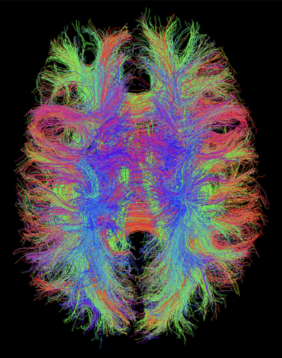

# Tractography

This page outlines TractoR's facilities for tractography, otherwise known as tract tracing, virtual dissection or white matter segmentation. The package currently offers seed-based or mask-based probabilistic tractography, based on a tensor or ball-and-sticks diffusion model. Streamline pathways, visitation maps and connectivity profiles can be obtained.

## The track script

Tractography in TractoR is run using the `track` script, which requires some [fully preprocessed](diffusion-processing.html) diffusion MR data, stored in a [session directory](conventions.html). A simple example is

    tractor track /data/subject1 TractName:global

which will generate 100 streamlines from each voxel within the brain mask of the session directory rooted at `/data/subject1`, and write out an image whose voxels indicate the total number of streamlines passing through in each case. The `TractName` option determines the name of all output files.

Note that TractoR's tractography is probabilistic, in the sense that an element of randomness is involved, which means that repeated tracing from a given seed point will not in general produce equivalent results. There are three reasons for this:

- **Seeding jitter.** By default, each streamline is initiated from a random position *within* the voxel. This avoids the rather artificial grid structure that results from always seeding at voxel centre points. It can be disabled by setting the `JitterSeeds` option to `false`.
- **Modelling uncertainty.** The BEDPOSTX ball-and-sticks model fitted by the `bedpost` script, which is the preferred diffusion model in TractoR, estimates a posterior distribution over fibre directions in each voxel. A sample from this distribution is drawn in each voxel visited during the tracking process. This aspect is not relevant to the diffusion tensor model, which can be selected with `PreferredModel:dti`.
- **Probabilistic interpolation.** Like some other software, TractoR uses a probabilistic analogue of trilinear interpolation to identify suitable fibre directions at subvoxel locations. Under this scheme, neighbouring voxels are chosen as the source with a probability that is proportional to their proximity. This is built into the algorithm, and cannot be changed.

## Seeding options

Instead of using the whole brain mask to seed, there are a number of options to narrow down the scope of seeding. The most obvious is to specify a location explicitly, as in

    tractor track /data/subject1 41,38,23 Streamlines:1000

which seeds 1000 streamlines from voxel location (41,38,23). Notice that these indices are 1-based, and correspond to the locations given by the internal viewer (`tractor view`).

A second option is to specify an image file as the second argument, which will be used as a mask.

Thirdly, if a [parcellation is available](structural.html), labelled regions in the parcellation may be specified by name or type (following the names in the auxiliary .lut file). For example,

    tractor track /data/subject1 white_matter

will seed in all white matter voxels, if such a region is defined.

Further refinement of the seeding region is possible using options such as `AnisotropyThreshold`, which ignores seeds with a fractional anisotropy below a specified threshold, and `BoundaryManipulation`, which applies mathematical morphology to the seed region. For example,

    tractor track /data/subject1 postcentral_gyrus_left BoundaryManipulation:outer

will extract the left postcentral gyrus from the parcellation, apply a morphological dilation and subtract the original mask, resulting in a set of seed voxels just outside this grey matter region. These will typically correspond to neighbouring white matter and cerebrospinal fluid. The latter can be removed by setting an `AnisotropyThreshold`.

## Target regions

As well as the seeding regions, a set of target areas can be specified, and streamlines may optionally be required to pass through them, or else truncated when they do so. This is often a prelude to creating a diffusion-based [connectivity graph](connectivity-graphs.html). Like seed masks, target regions can be standalone image files or named regions from a parcellation. For example,

    tractor track /data/subject1 white_matter TargetRegions:cerebal_cortex TerminateAtTargets:true MinTargetHits:2

seeds from every white matter voxel and terminates in cortical grey matter regions. The option `MinTargetHits:2` stipulates that both ends of the streamline must reach a target, otherwise it is rejected and not included in the result.

If the actual streamlines are required, in addition to a visitation map or instead of it, the option `RequirePaths:true` can be added. In this case the streamlines are written to a .trk file, which can be opened in [TrackVis](http://trackvis.org) for visualisation as shown below.

If target regions are used then an [auxiliary .trkl file](conventions.html#file-types) will also be created. This is a TractoR-specific extension that stores information about which streamlines reached which targets, for rapid lookup in other scripts such as [`graph-build`](connectivity-graphs.html).

Basic information about the contents of a .trk file can be obtained using the `trkinfo` script, and further mapping, of the seed or end-points is available through the `trkmap` script.

Finally, the `track` scripts offers connectivity profiling, which is often performed voxelwise to identify the distribution of end-points of streamlines emanating from that location. The key option here is `RequireProfiles`.

    tractor track /data/subject1 thalamus_left Strategy:voxelwise TargetRegions:cerebal_cortex TerminateAtTargets:true RequireProfiles:true

Here, the `Strategy:voxelwise` option forces tractography to be run separately for each seed point. In each case, the number of "hits" to each target are counted, and the result is written into a standard CSV file, which can be opened in R or Microsoft Excel.

## Neighbourhood tractography

An alternative to conventional tractography is [probabilistic neighbourhood tractography](PNT-tutorial.html), which is focussed on automatic segmentation of predefined major tracts, in a way that is consistent across subjects. There are separate scripts for that, which [the tutorial](PNT-tutorial.html) explores.
